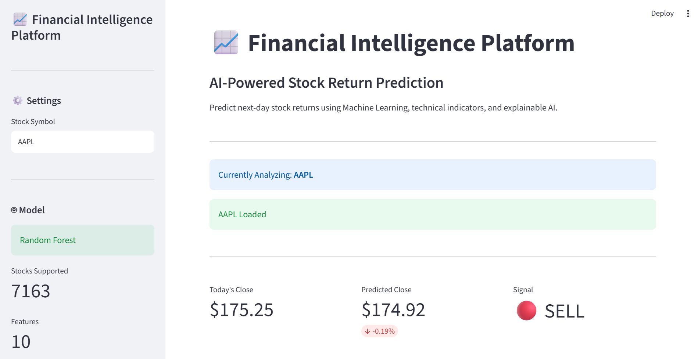
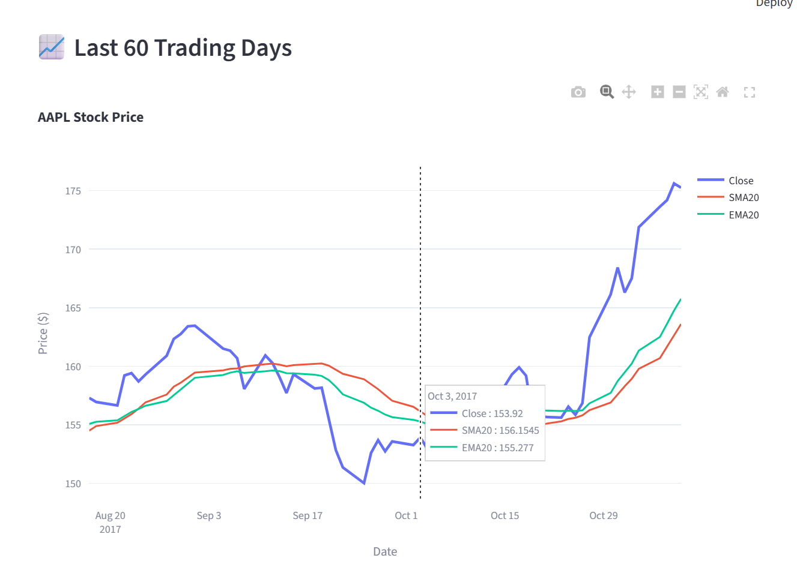
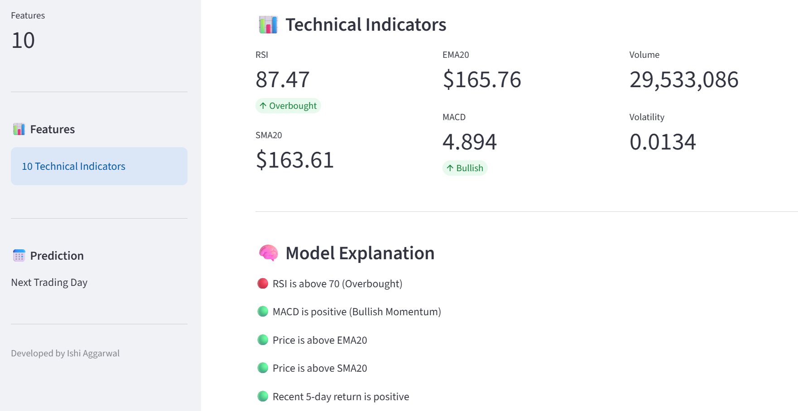
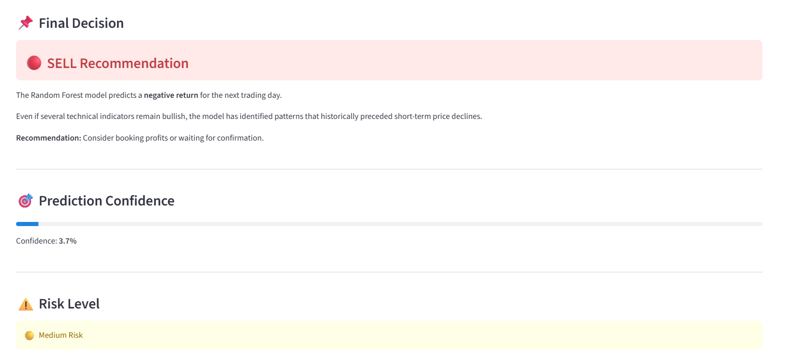
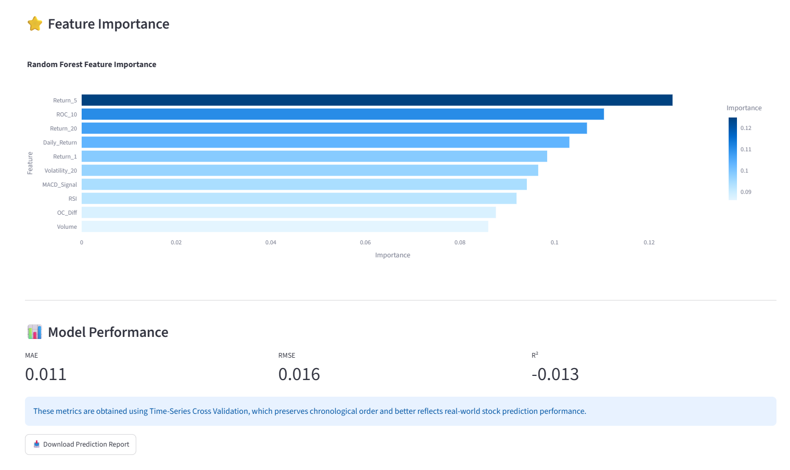

# Financial Intelligence Platform

> An end-to-end Machine Learning platform for predicting next-day stock returns using technical indicators, feature engineering, Random Forest Regression, and an interactive Streamlit dashboard.


---
## Overview

The Financial Intelligence Platform is an end-to-end Machine Learning application designed to predict the next day's stock return using historical market data and technical indicators.

The project combines:

- Feature Engineering
- Machine Learning
- Technical Analysis
- Interactive Visualization
- Streamlit Dashboard

Users can select a stock, visualize its recent price movement, inspect important technical indicators, receive an AI-generated prediction, and understand the reasoning behind the prediction through an explainable dashboard.
## Features

- Predict next-day stock returns
- Generate BUY / SELL signals
- Interactive stock price visualization
- SMA & EMA overlays
- RSI, MACD, Volatility and Volume indicators
- Model Explanation Panel
- Random Forest Feature Importance
- Time-Series Cross Validation Metrics
- Download Prediction Report
- Interactive Streamlit Dashboard
# Dashboard Preview

## Home



---

## Price Analysis



---

## Technical Analysis



---

## Explaination



---

## Model Performance and Feature Importance



# Project Architecture

```text
                 Historical Stock Data
                          │
                          ▼
                  Data Loading Module
                          │
                          ▼
                 Feature Engineering
                          │
                          ▼
                 Feature Selection
                          │
                          ▼
             Random Forest Regression
                          │
                          ▼
                  Model Evaluation
                          │
                          ▼
              Saved Model (.pkl Files)
                          │
                          ▼
               Streamlit Web Dashboard
                          │
                          ▼
        Prediction • Charts • Technical Analysis
```
## Project Structure

```text
Financial_Intelligence_Platform/
│
├── app.py
├── main.py
├── predict.py
├── requirements.txt
├── README.md
│
├── Data/
│   └── Raw/
│       └── Stocks/
│
├── Models/
│   ├── random_forest.pkl
│   ├── scaler.pkl
│   └── top_features.pkl
│
├── Output/
├── results/
│   └── model_comparison.csv
│
├── assets/
│
└── src/
    ├── config.py
    ├── data_loader.py
    ├── feature_engineering.py
    ├── preprocessing.py
    ├── train_models.py
    ├── evaluate.py
    ├── visualization.py
```
## Technology Stack

| Category | Technologies |
|----------|--------------|
| Language | Python |
| Machine Learning | Scikit-Learn |
| Data Processing | Pandas, NumPy |
| Visualization | Plotly, Matplotlib |
| Dashboard | Streamlit |
| Model | Random Forest Regressor |
| Feature Engineering | Technical Indicators |
| Version Control | Git & GitHub |
## Machine Learning Workflow

1. Load historical stock market data.
2. Clean and preprocess the dataset.
3. Generate technical indicators.
4. Select the most informative features.
5. Train a Random Forest Regression model.
6. Evaluate using Time-Series Cross Validation.
7. Save the trained model.
8. Deploy the model through an interactive Streamlit dashboard.

## Model Performance

The model was evaluated using Time-Series Cross Validation to preserve the chronological nature of stock market data.

Evaluation Metrics include:

- Mean Absolute Error (MAE)
- Root Mean Squared Error (RMSE)
- R² Score

These metrics are displayed directly within the Streamlit dashboard to provide transparency regarding the model's predictive performance.

> **Note:** Stock price prediction is a challenging time-series forecasting problem influenced by many external factors. This project focuses on building a complete end-to-end machine learning pipeline and interactive analytics dashboard rather than guaranteeing profitable trading signals.
## Installation

Clone the repository

```bash
git clone https://github.com/Ishi-gitcom/financial-intelligence-platform.git
```

Move into the project directory

```bash
cd financial-intelligence-platform
```

Install dependencies

```bash
pip install -r requirements.txt
```
## Run the Application

Launch the Streamlit dashboard

```bash
streamlit run app.py
```

The dashboard will open in your default browser.
## Dataset

The complete dataset is not included in this repository due to its large size.
This repository contains a small sample dataset for demonstration purposes.
The full dataset can be downloaded from:
https://www.kaggle.com/datasets/borismarjanovic/price-volume-data-for-all-us-stocks-etfs
After downloading, place the files inside:
Data/Raw/Stocks/

## Future Improvements

- Live stock data integration using Yahoo Finance APIs.
- Support for multiple machine learning models (XGBoost, LightGBM, LSTM).
- Multi-day stock price forecasting.
- Portfolio optimization and risk analysis.
- SHAP-based model explainability.
- News sentiment analysis.
- Cloud deployment for real-time accessibility.
## Author

**Ishi Aggarwal**

B.Tech Electronics & Communication in Advanced Communication Technology

If you found this project useful, consider giving it a ⭐ on GitHub.
